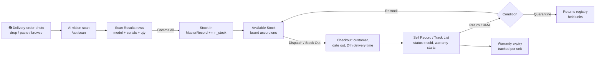
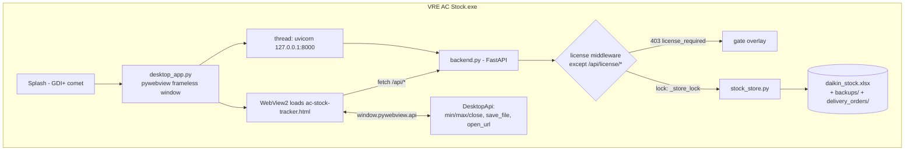
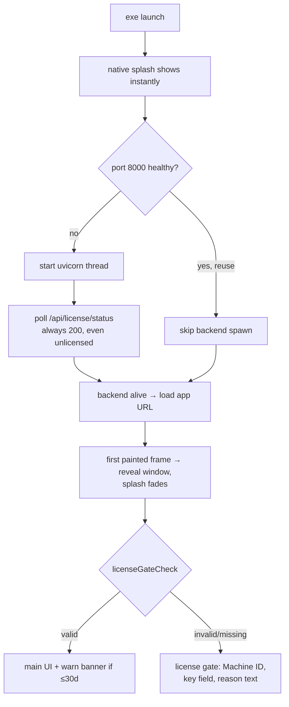

# VRE AC Stock — Flow Charts

## 1. Business workflow (what the app is for)



## 2. Runtime architecture (one exe, three layers)



## 3. Boot sequence



## 4. License lifecycle

```mermaid
flowchart LR
    subgraph YOU["Your machine"]
        G[License Generator exe<br/>+ license_private.pem] -->|sign VRE1.key| K
    end
    subgraph CLIENT["Client PC"]
        A[App boot] --> B{license.lic<br/>beside exe?}
        B -->|no/invalid| C[Gate: shows<br/>Machine ID]
        C --> D[Purchase Renewal →<br/>copies ID + opens<br/>t.me/chh_ck]
        D -->|customer sends ID| E[you sign key<br/>locked to that ID]
        E --> F[customer pastes key]
        F --> H[/api/license/activate<br/>verifies sig + machine<br/>writes license.lic]
        B -->|valid| I{expiry +<br/>clock checks}
        H --> I
        I -->|ok| J[unlocked]
        I -->|≤30d| L[warning banner]
        I -->|expired/rollback| C
    end
```

## 5. Request lifecycle

```mermaid
flowchart LR
    A[fetch /api/x] --> B{path == license/status<br/>or license/activate?}
    B -->|yes| E[handle]
    B -->|no| C{license_check.status()}
    C -->|invalid| F[403 license_required<br/>+ machine + detail]
    C -->|valid| D[await _store_lock<br/>single-file workbook safety]
    D --> E
    E --> G[StockStore mutate]
    G --> H[save → auto-backup<br/>→ ready_exports]
```
